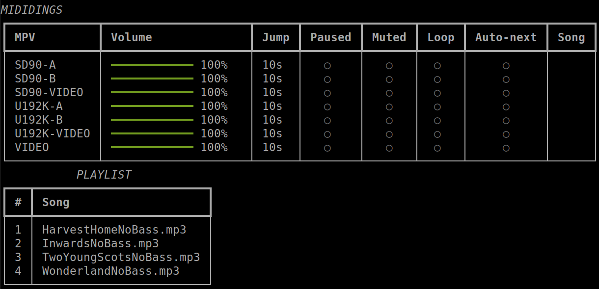

# mdg is tool to render a mididings script

## mididings latest version is required
* https://github.com/mididings/mididings
### It creates a mididings script from a collection of files defined by yourself using Mako templates
* The configuration file is src/config.json
* The templates are: 
  * main.mako
  * asoundrc.mako (optional) | Template for audio devices
      * Since ALSA ports assignation for PCM is dynamic, the script builder creates a ~/.asoundrc file for audio devices with the help of pyalsaaudio.

## Execution
#### Read all this README before the execution
* Execute `bash /src/launch.sh`
  * The script call `start_mpv.sh` to run the mpv audio/video player (remove this call if you don't use mpv)
  * Finally, it render to stdout a mididings script by replacing tokens in all Mako templates
  * The sdtout is redirect to script.py
    * And start `mididings -f script.py`
## Includes
#### The `src/includes` directory contains files needed to render the mididings script. 
* The order of the files is defined in `src/config.json`

## Adapters
#### The `src/adapters` directory contains adapters between mididings and plugins that not depend on mididings
  * **MpvAdapter**
    * This adapter is a callable object and it received MIDI messages from mididings and call methods in the **mpv plugins (MpvClient)** 

## Plugins
#### The `scr/plugins` directory contains callable objects.

## Plugins for audio/video
* **mpv** - control mpv player with JSON IPC
  * Play audio and video files
  * This pluging does not depends on mididings
* **Playlist** - List audio/video files in a directory with the name of the current scene. This plugin is used by the mpv adapter.
  * This pluging does not depends on mididings
* **Spotify** - call their API to control a player
  * This plugin depends on mididings

## Plugins for lightning
* **Philips Hue** - It allow the send requests to a Philips Hue Bridge

## Plugin for AKAI hardware
* **AKAI MIDIMIX** - Helper to manage the switch state and the LED of the Akai MIDIMIX

## Plugins for multi-effects
Bank selector - usefull in a scene init_patch
  * **GT1000** to switch bank on a BOSS GT-1000
    * init_patch=Call(GT1KPreset("P26-3"))
  * **ToneX** to switch bank on a ToneX
    * init_patch=Call(ToneX("31B"))
  * **HD500** to switch bank on a Line6 POD HD500
    * init_patch=Call(HD500PC("10C"))
## UI
A Rich UI is available on the terminal showning the state of the mpv player and the current playlist

## Dependencies
* mididings
* Mako
## Optionals mididings dependencies
* pyliblo3 if OscInterface() is used
* watchdog if AutoRestart() is used
* stagedings for scene navigation and OSC control
## Plugins dependencies
* mpv
* pyalsaaudio
* spotipy
* phue
* requests
* spotipy
* rich
